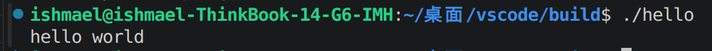

# hello
can only say hello to you


## This is the easiest C++ program forever
no arguments
__________




## 目录
1.开发环境
2.技术栈
3.安装
4.库

## 开发环境

| 类别 | 工具 |
| --- | --- |
| 操作系统 | Linux |
| 编辑器 | VS Code |
| 版本控制 | Git |

## 技术栈

- 操作系统：Linux Ubuntu
- 开发工具：VS Code、Git
- 编程语言：C++

## 库
只有 `iostream `

## 安装
```bash
$ cmake -S . -B build # '.'两端必须有空格
$ --build build -j
```
## 运行
```bash
$ ./build/hello #注意是否在正确的相对路径
```